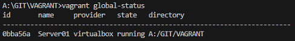
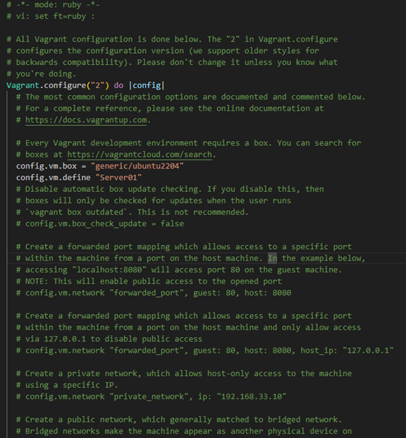

### **Comandos Vagrant**

---

* Inicializar y descargar imagen box :

```
vagrant box add generic/ubuntu2204
```

* Ejecutar el init para generar el vagrant file:

```
vagrant init generic/ubuntu2204
```

* Para loguearse a la VM creada, ir al directorio en donde se encuentra el vagrantfile:

```
vagrant ssh
```

* Buscar VM creadas:

```
vagrant global-status
```



* Identificar ID y borrar el recurso:

```
vagrant halt <ID>
vagrant destrot <ID>
```

# **Vagrant File estructura:**




# **RECURSOS**

[https://vagrant-intro.readthedocs.io/es/latest/destroy.html](Docs oficial vagrant)
